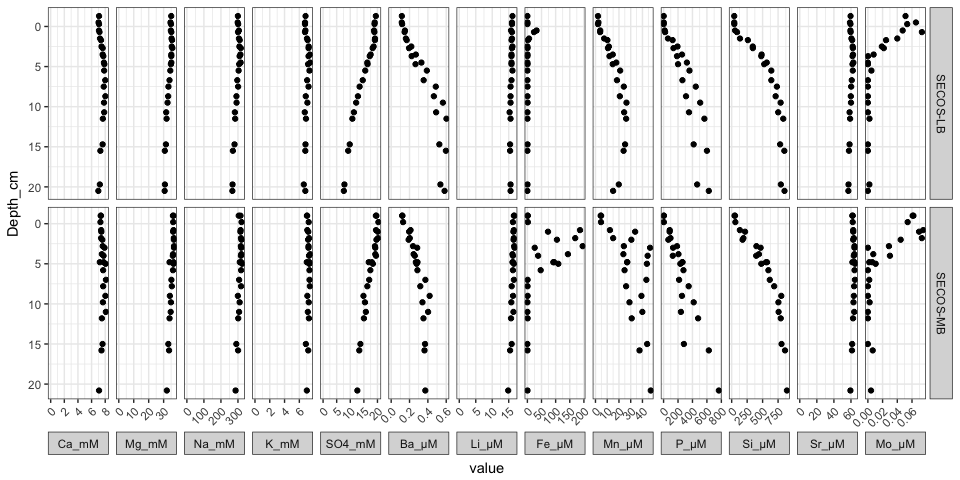

Diffusive equilibration in thin-films (DET) - helper functions
================
Marko Lipka
February 26, 2018

Collection of simple functions for calculations in the context of DET applications:

-   *DET.slice.volume.ccm(slice.width.mm, gel.thickness.mm = 1, DET.window.width.mm = 20)* calculates the volume of a rectangular DET gel slice from
    -   DET window width (default = 20 mm),
    -   gel thickness (default = 1 mm) and
    -   slice width
-   *DET.slice.amount.uM(V.slice.ccm, c.ambient.uM, ...)* returns the amount of substance of a solute in a slice of given volume (*V.slice.ccm*) or geometry (arguments passed to *DET.slice.volume.ccm()*, see above) after equilibration with ambient solute concentration

-   *DET.extract.conc.uM(n.slice.umol, V.extraction.uL, ...)* returns the concentration of a gel extract made with a given eluent volume and the amount of substance of a solute in the extracted slice. Instead of *n.slice.umol*, arguments of the above described functions can be provided instead (handed to the *DET.slice.amount.uM()* function).

Background
==========

Biogeochemical processes in organic-rich sediments or fluxes through the benthic boundary layer are reflected by concentration gradients of nutrients, redox-metabolites and metals. It is desirable to sample these transition zones at highest possible resolutions. The diffusive equilibration in thin-films (DET) technique is based on the application of thin polyacrylamide gel films, which are convenient to prepare, stable, easy and clean to use, and require a relatively short time for solution equilibration (within hours) (Krom et al. 1994; Harper, Davison, and Tych 1997). The DET gels are usually sliced to the required spatial resolution after recovery. For concentration analysis, the gel slices are back equilibrated by extracting them with a small volume of deionized water or another eluent. To minimize back-equilibration times for DET analysis, diffusional path lengths and eluent volumes should be as small as possible (Harper, Davison, and Tych 1997).

Examples
========

DET application in marine sediments
-----------------------------------

### Known pore water concentration profiles from sampling with Rhizons

### Potential range of concentration values in DET slices applied in the same sediments

With a DET gel slice width of 0.1 cm and an extraction volume of 100 µL, the following concentration ranges can be expected in the DET slice extracts.

<table style="width:32%;">
<colgroup>
<col width="18%" />
<col width="6%" />
<col width="6%" />
</colgroup>
<tbody>
<tr class="odd">
<td align="center"><strong>Ca_mM</strong></td>
<td align="center">1</td>
<td align="center">1</td>
</tr>
<tr class="even">
<td align="center"><strong>Mg_mM</strong></td>
<td align="center">5</td>
<td align="center">6</td>
</tr>
<tr class="odd">
<td align="center"><strong>Na_mM</strong></td>
<td align="center">45</td>
<td align="center">54</td>
</tr>
<tr class="even">
<td align="center"><strong>K_mM</strong></td>
<td align="center">1</td>
<td align="center">1</td>
</tr>
<tr class="odd">
<td align="center"><strong>SO4_mM</strong></td>
<td align="center">1</td>
<td align="center">3</td>
</tr>
<tr class="even">
<td align="center"><strong>Ba_µM</strong></td>
<td align="center">0</td>
<td align="center">0</td>
</tr>
<tr class="odd">
<td align="center"><strong>Li_µM</strong></td>
<td align="center">2</td>
<td align="center">3</td>
</tr>
<tr class="even">
<td align="center"><strong>Fe_µM</strong></td>
<td align="center">0</td>
<td align="center">33</td>
</tr>
<tr class="odd">
<td align="center"><strong>Mn_µM</strong></td>
<td align="center">0</td>
<td align="center">8</td>
</tr>
<tr class="even">
<td align="center"><strong>P_µM</strong></td>
<td align="center">0</td>
<td align="center">128</td>
</tr>
<tr class="odd">
<td align="center"><strong>Si_µM</strong></td>
<td align="center">7</td>
<td align="center">149</td>
</tr>
<tr class="even">
<td align="center"><strong>Sr_µM</strong></td>
<td align="center">9</td>
<td align="center">11</td>
</tr>
<tr class="odd">
<td align="center"><strong>Mo_µM</strong></td>
<td align="center">0</td>
<td align="center">0</td>
</tr>
</tbody>
</table>

Based on these values, the further analysis of the extracts can be planned precisely, so that only a minimum of extract volume must be used.

ToDo
====

-   calculate application times depending on gel thickness
-   get slope from highres conc profile
-   plot 2D solute distribution when gel cut into a matrix instead of slices

References
==========

Harper, Michael P., William Davison, and Wlodek Tych. 1997. “Temporal, spatial, and resolution constraints for in situ sampling devices using diffusional equilibration: Dialysis and DET.” *Environmental Science and Technology* 31 (11): 3110–9. doi:[10.1021/es9700515](https://doi.org/10.1021/es9700515).

Krom, M. D., P. Davison, H. Zhang, and W. Davison. 1994. “High‐resolution pore‐water sampling with a gel sampler.” *Limnology and Oceanography* 39 (8): 1967–72. doi:[10.4319/lo.1994.39.8.1967](https://doi.org/10.4319/lo.1994.39.8.1967).
